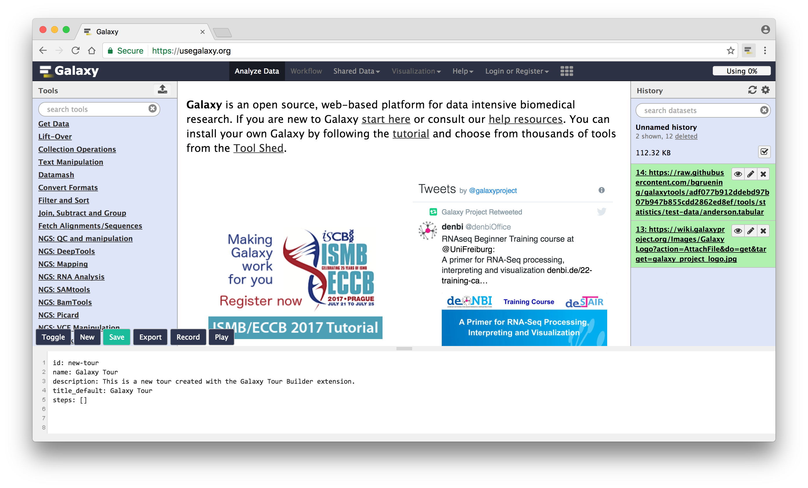

  <h1>
    
    galaxy-tourbuilder
  </h1>

  

    <strong>The amazing Galaxy Tour Builder web extension.</strong>
  

  

    Check out the video: <a href="https://imgur.com/a/0YVvz">https://imgur.com/a/0YVvz</a>.</strong>
     
    Support all Galaxy instances · Record/Pause · Live simulation
  

  

    
  

## Installation

1. Clone this repository
2. Run `npm install`
3. Run `npm run build`

##### Load the extension in Chrome & Opera

1. Open Chrome/Opera browser and navigate to chrome://extensions
2. Select "Developer Mode" and then click "Load unpacked extension..."
3. From the file browser, choose to `galaxy-tourbuilder/build/chrome` or
   (`galaxy-tourbuilder/build/opera`)

##### Load the extension in Firefox

1. Open Firefox browser and navigate to about:debugging
2. Click "Load Temporary Add-on" and from the file browser, choose
   `galaxy-tourbuilder/build/firefox`

## Developing

The following tasks can be used when you want to start developing the extension
and want to enable live reload -

- `npm run chrome-watch`
- `npm run opera-watch`
- `npm run firefox-watch`

## Packaging

Run `npm run dist` to create a zipped, production-ready extension for each
browser. You can then upload that to the appstore.

## Credits

This project has been initiated during a hackathon a while ago in Freiburg, then
[Dannon Baker](https://github.com/dannon) started a Chrome extension
[port](https://github.com/dannon/tourbuilder). In no particular order, [Florian
Eggenhofer](https://github.com/eggzilla), [Matthias
Bernt](https://github.com/bernt-matthias), [Bérénice
Batut](https://github.com/bebatut) and [Clemens
Blank](https://github.com/blankclemens) have contributed to this port and
therefore to this project.

## License

galaxy-tourbuilder is released under the MIT License. See the bundled
[LICENSE](LICENSE) file for details.
